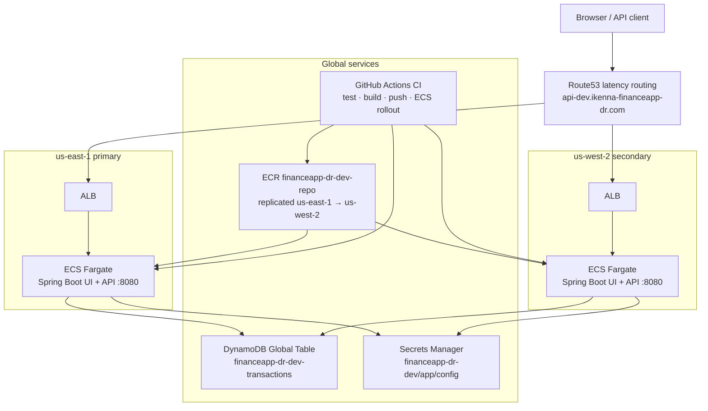

# Production-Ready Java DR App (AWS + Terraform, Active-Active)

Portfolio project demonstrating a production-minded **full-stack banking app** — server-rendered Thymeleaf UI plus JSON API — deployed across two AWS regions with active-active traffic routing and globally replicated data.

## Repository Layout

- `app/` - Spring Boot app (Thymeleaf UI + `/api/*` REST API)
- `infra/terraform/` - Modular Terraform for AWS infrastructure
- `docs/` - Runbook, DR test evidence, and architecture notes ([`docs/PORTFOLIO.md`](docs/PORTFOLIO.md) includes the detailed VPC/subnet diagram)
- `.github/workflows/` - CI checks for Java and Terraform

## High-Level Capabilities

- Active-active multi-region app on ECS Fargate
- Route53 latency/health-based routing
- DynamoDB Global Tables for cross-region data replication
- Secrets Manager regional replication pattern
- Observability, alarms, and incident runbook

## Architecture

Active-active deployment in `us-east-1` (primary) and `us-west-2` (secondary). One Docker image per region serves the banking UI and API; DynamoDB Global Table keeps data in sync.



### Request path

1. DNS resolves via Route53 to the lowest-latency healthy regional ALB (`/health` checks).
2. ALB forwards to an ECS Fargate task running Spring Boot (JWT cookie auth; CSRF on browser forms).
3. Reads and writes hit the DynamoDB Global Table; changes replicate to the other region within seconds.
4. GitHub Actions builds the image, pushes to ECR, and force-deploys both ECS services on `main`.

### Component map (dev)

| Layer | Resource |
|-------|----------|
| DNS | `api-dev.ikenna-financeapp-dr.com` |
| Compute | ECS `financeapp-dr-dev-primary-service` / `financeapp-dr-dev-secondary-service` |
| Data | DynamoDB `financeapp-dr-dev-transactions` |
| Images | ECR `financeapp-dr-dev-repo` |
| Secrets | `financeapp-dr-dev/app/config` |
| State | S3 `financeapp-tf-state-920375856513` + DynamoDB lock `financeapp-tf-locks` |

### Live endpoints (dev)

- **App:** [http://api-dev.ikenna-financeapp-dr.com/](http://api-dev.ikenna-financeapp-dr.com/) (or primary ALB: `http://financeapp-dr-dev-primary-alb-681197869.us-east-1.elb.amazonaws.com/` if DNS is still propagating)
- **Health:** `/health`
- **Demo login:** `alice` / `Password!1`

### Further reading

- [`docs/PORTFOLIO.md`](docs/PORTFOLIO.md) — VPC/subnet map, banking model, auth design, data schema
- [`docs/DR-TEST-RESULTS.md`](docs/DR-TEST-RESULTS.md) — disaster recovery test evidence
- [`docs/RUNBOOK.md`](docs/RUNBOOK.md) — operations and incident response

## Quick Start

1. **Configure environment (once):**
   ```bash
   cp .env.example .env
   # edit .env — assistant, AWS deploy, and optional TF_VAR_* secrets
   ```
   Spring Boot loads only `ASSISTANT_*`, `OPENAI_*`, and `APP_*` from `.env`. Deploy keys are for shell scripts only.

2. **Run locally (UI + API):**
   ```bash
   ./run-local.sh
   ```
   Open [http://localhost:8080/](http://localhost:8080/) — sign in with `alice` / `Password!1`

3. Build and test API:
   - `cd app && mvn -B clean verify`
4. Validate Terraform:
   - `cd infra/terraform/environments/dev`
   - `terraform init`
   - `terraform validate`

## Deploy to AWS (dev)

Two layers — keep them separate:

| Layer | When | Command |
|---|---|---|
| **Infrastructure** (VPC, ECS, DDB, Route53) | Module or env changes | `./infra-deploy.sh plan dev` then `./infra-deploy.sh apply dev` |
| **Application** (Docker image + ECS rollout) | Every release | `./deploy-dev.sh` or CI on `main` |

**First-time / infra change:**

```bash
cp .env.example .env   # if not done yet
./infra-deploy.sh plan dev
./infra-deploy.sh apply dev
./deploy-dev.sh
```

All deploy scripts (`run-local.sh`, `infra-deploy.sh`, `deploy-dev.sh`) source root `.env` via [`scripts/load-env.sh`](scripts/load-env.sh).

**Routine app release (no Terraform changes):**

```bash
./deploy-dev.sh
```

**Teardown:**

```bash
CONFIRM=destroy ./infra-deploy.sh destroy dev
```

**CI/CD (app):** push or merge to `main` — GitHub Actions runs tests, builds the Docker image, pushes to ECR, and force-rolls both ECS services (`us-east-1` + `us-west-2`). Re-deploy from the Actions tab via **Run workflow** (`workflow_dispatch`).

**CI/CD (infra):** manual **Apply Infrastructure (Terraform)** workflow — type `apply` to confirm. Do not auto-apply Terraform on every push.

Copy [`.env.example`](.env.example) to `.env` for local scripts, and [`infra/terraform/environments/dev/terraform.tfvars.example`](infra/terraform/environments/dev/terraform.tfvars.example) to `terraform.tfvars` for Terraform defaults. Optional `TF_VAR_*` entries in `.env` override tfvars secrets.

Repository secrets required for CI: `AWS_ACCESS_KEY_ID`, `AWS_SECRET_ACCESS_KEY` (optional for infra apply: `TF_VAR_JWT_SECRET_DEV`, `TF_VAR_SECRET_VALUE_DEV`).
