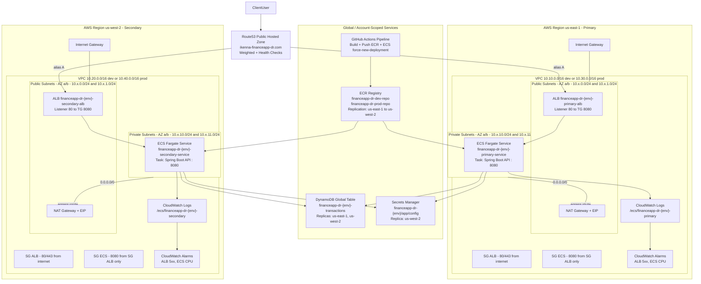

# Portfolio Narrative

## What This Project Demonstrates

- Designing active-active disaster recovery with clear tradeoffs
- Building a **full-stack banking application** (server-rendered UI + JSON API) with self-service signup, atomic peer-to-peer transfers, real running balances, strong password policy, and a per-user audit log
- Delivering modular Terraform with environment isolation
- Applying CI quality gates for app and infrastructure code
- Operating with runbooks and game day evidence

## Front-end and Authentication

The same Spring Boot Docker image now serves **both** the JSON API and a server-rendered Thymeleaf UI styled with Tailwind (CDN; no JS build step). One container, one ALB target group, one ECS service per region — no extra moving parts in either region's failover story.

### UI surface

| Route | Purpose |
|---|---|
| `GET /login`, `POST /login` | Username/password form; on success issues a JWT cookie and redirects to `/dashboard` |
| `POST /logout` | Clears the JWT cookie and returns to `/login` |
| `GET /dashboard` | Balance card, last 10 transactions, region badge (`us-east-1` or `us-west-2` — visible proof of which region served you) |
| `GET /accounts/{id}` | Paginated full transaction history with base64 cursor links |
| `GET /accounts/{id}/transactions/new` | New-transaction form (amount / currency / description / status) |
| `POST /accounts/{id}/transactions` | Server generates an `X-Request-Id` UUID for idempotency, then redirects |

The existing JSON API has moved under `/api/*` so the form-based UI and machine clients coexist on one image, both authenticated by the same JWT.

### Authentication design

- **BCrypt password hashes** stored in DynamoDB under `pk=USER#<username>` (single-table — same schema, no new infra).
- **HS256 JWT** signed with `APP_JWT_SECRET` (Terraform-injected `-var jwt_secret`, identical in both regions so a token issued by `us-east-1` is valid against `us-west-2` and vice versa — true active-active session continuity).
- Token carried in an `HttpOnly; SameSite=Strict` cookie. `Authorization: Bearer` is accepted too for `curl`/Postman.
- `JwtAuthFilter` runs before Spring's auth filter, validates the token, and seeds `SecurityContext` with an `AuthenticatedUser` principal (`userId`, `username`, `displayName`, `accountId`).
- `SecurityConfig` whitelists `/login`, `/logout`, `/health`, `/actuator/health/**` and static assets; everything else requires `ROLE_USER`. Unauth'd browser requests redirect to `/login`; unauth'd `/api/*` requests return `401`.
- `WebController` enforces that the JWT's `accountId` matches the URL path — accessing another user's account returns `403`.

### Seeded demo users

A `UserSeeder` `CommandLineRunner` (gated on `APP_SEED_ENABLED=true`) idempotently inserts five users at startup, each with one USD account and a $1,000 starting balance credited via an idempotent `deposit("seed-bonus-<username>", ...)`. Password for all is `Password!1`.

| Username | Display Name | Starting balance |
|---|---|---|
| alice | Alice Anderson | $1,000.00 |
| bob | Bob Brown | $1,000.00 |
| carol | Carol Chen | $1,000.00 |
| dave | Dave Davies | $1,000.00 |
| eve | Eve Evans | $1,000.00 |

Re-seeding is safe — the seeder skips any `USER#<username>` that already exists and the deterministic idempotency key prevents double-crediting the bonus. Both regions can run the seeder concurrently; DDB's conditional `PutItem` keeps it conflict-free.

### What this proves end-to-end

Every UI transaction is persisted with `createdByUserId` and `createdByUsername`, written by `TransactWriteItems` (idempotency + balance update + txn rows atomically), and replicated by the DDB Global Table to the other region within seconds. The "region badge" in the dashboard lets you visually confirm which region served your request, while the transaction list shows rows tagged with the region they were created in — direct evidence of active-active reads and writes from a single user session.

## Banking Features

### Self-service signup with strong password policy

- `GET /signup` renders a Tailwind form with a live client-side checklist (length, upper/lower/digit/symbol).
- Server-side `@StrongPassword` Bean Validation constraint enforces:
  - Minimum 12 characters
  - At least one uppercase, lowercase, digit, and symbol
  - Rejection against a bundled 1,000-entry common-password blocklist (`security/top-1000-passwords.txt`, loaded into a `HashSet` once at startup)
- Passwords are hashed with **BCrypt cost 12** before persisting.
- Successful signup atomically creates the account, the user, and credits a $1,000 welcome bonus via the standard `deposit()` path (no special code path), then auto-issues a JWT cookie and redirects to `/dashboard?welcome=1`.

### Atomic peer-to-peer transfers

`POST /api/transfers` (and the `/transfer` UI form) execute a single DynamoDB `TransactWriteItems` with five items:

1. **Idempotency** PUT (`IDEMPOTENCY#<requestId>`, conditional on `attribute_not_exists(pk)`)
2. **Sender debit** UPDATE — `SET balance = balance - :amt` with condition `attribute_exists(balance) AND balance >= :amt` (the conditional check is what guarantees no overdraft; failure surfaces as `ConditionalCheckFailed` → `InsufficientFundsException` → HTTP 422)
3. **Receiver credit** UPDATE — `SET balance = balance + :amt`
4. **Sender TXN row** — `TRANSFER_OUT`, `signedAmount = -amt`, `balanceAfter = senderBalance - amt`, with `counterpartyUsername`
5. **Receiver TXN row** — `TRANSFER_IN`, `signedAmount = +amt`, `balanceAfter = receiverBalance + amt`, with `counterpartyUsername`

All five succeed or all five roll back. The DDB Global Table replicates the result to the other region in under a second, so a logged-in user can immediately see the new balance regardless of which ALB they hit next.

### Audit trail

Every signup, login success, login failure, deposit, withdrawal, and transfer is recorded as an `AUDIT` item:

| Key | Use |
|---|---|
| `AUDIT#USER#<userId>` / `EVENT#<ulid>` | Per-user activity log |
| `AUDIT#USERNAME#<username>` / `EVENT#<ulid>` | Failed logins for unknown users (the username they tried) |

Audit writes happen **outside** the transactional banking path (fire-and-forget) so an audit-store hiccup never blocks a banking action; failures log at WARN. Each item carries `eventType`, `region`, `ip` (with `X-Forwarded-For` resolution), `userAgent`, free-form `details`, `createdAt`, and a 90-day `ttl` so the audit log self-cleans without manual housekeeping. Per-user access is paginated via `/audit` (UI) and `GET /api/audit/me` (JSON).

### Anti-timing-attack login

Failed `POST /login` calls always sleep ~250 ms (plus a random 0-75 ms jitter) before responding to flatten the timing signal between "user doesn't exist" and "password mismatch". Both failure modes also write an `AUDIT` entry capturing the attempted username and IP.

## Architecture Choices

- **Compute:** ECS Fargate in two regions for managed operations and clean scaling
- **Traffic:** Route53 **latency-based** routing + health checks for active-active request distribution (each user lands in their lowest-RTT region; module also supports weighted policy for canary/blue-green)
- **Data:** DynamoDB Global Table for low-ops multi-region replication, **single-table design** (Account, Transaction, IdempotencyKey)
- **Secrets:** Secrets Manager replication to avoid regional secret dependency
- **Images:** ECR registry replication (`us-east-1 → us-west-2`) so the secondary region pulls locally
- **State:** S3 backend bucket with versioning codified via a `bootstrap` Terraform stack
- **Observability:** CloudWatch metrics/alarms and actuator health endpoints

## Data Model — Single-Table DynamoDB Schema

Table: `financeapp-dr-{env}-transactions` (Global Table, replicas in `us-east-1` and `us-west-2`).
- Primary key: `pk` (S) + `sk` (S)
- GSI1 `gsi1-by-transaction-id`: `gsi1pk` (S) + `gsi1sk` (S), projection `ALL`
- TTL attribute: `ttl` (only set on `IDEMPOTENCY#` items, auto-expires after 24h)
- Billing: `PAY_PER_REQUEST`; Streams: `NEW_AND_OLD_IMAGES` (required for global replication); PITR: enabled

| Entity | pk | sk | gsi1pk | gsi1sk | Notes |
|---|---|---|---|---|---|
| Account | `ACCOUNT#<accountId>` | `METADATA` | — | — | One per account, conditional put; carries `balance` (N) updated atomically by `TransactWriteItems` |
| Transaction | `ACCOUNT#<accountId>` | `TXN#<ulid>` | `TXN#<transactionId>` | `TXN#<transactionId>` | ULID `sk` for time-sorted listing; carries `type`, `signedAmount`, `balanceAfter`, `paymentMethod`, `paymentReference`, `counterpartyUsername`, `createdByUserId`, `region` |
| IdempotencyKey | `IDEMPOTENCY#<requestId>` | `METADATA` | — | — | TTL = `now + 24h`; PUT'd in the same `TransactWriteItems` as the transaction |
| User | `USER#<username>` | `METADATA` | — | — | BCrypt-12 `passwordHash`, `defaultAccountId`; conditional put for username uniqueness |
| PaymentMethod (demo card) | `PAYMENT#USER#<userId>` | `CARD#DEMO` | — | — | Auto-provisioned on signup; `brand`, `last4`, `maskedReference` |
| PaymentMethod (demo PayPal) | `PAYMENT#USER#<userId>` | `PAYPAL#DEMO` | — | — | Linked on first withdraw; stores PayPal email |
| AuditEvent | `AUDIT#USER#<userId>` | `EVENT#<ulid>` | — | — | `eventType` (`DEPOSIT_CARD`, `WITHDRAWAL_PAYPAL`, …), `ip`, `userAgent`, `region`, `details`; 90-day `ttl`. Failed logins for unknown users use `AUDIT#USER#UNKNOWN`. |

### Access Patterns

| # | Pattern | DynamoDB op | Keys |
|---|---|---|---|
| 1 | Create account | `PutItem` w/ condition | `pk=ACCOUNT#…`, `sk=METADATA`, `attribute_not_exists(pk)`, `balance=0` |
| 2 | Get account | `GetItem` consistent | `pk=ACCOUNT#…`, `sk=METADATA` |
| 3 | Deposit | `TransactWriteItems` (3 items) | Idempotency PUT + balance UPDATE (`SET balance = balance + :amt`) + TXN row PUT |
| 4 | Withdraw | `TransactWriteItems` (3 items) | Idempotency PUT + balance UPDATE with condition `balance >= :amt` + TXN row PUT |
| 5 | Transfer (P2P) | `TransactWriteItems` (5 items) | Idempotency PUT + sender debit (with `balance >= :amt`) + receiver credit + sender TXN_OUT + receiver TXN_IN |
| 6 | Get transaction by id | `Query` on GSI1 | `gsi1pk=TXN#<id>` |
| 7 | List recent transactions for account (paged) | `Query` main table | `pk=ACCOUNT#…`, `begins_with(sk, "TXN#")`, `ScanIndexForward=false`, base64 `LastEvaluatedKey` cursor |
| 8 | Per-user audit log (paged) | `Query` main table | `pk=AUDIT#USER#<id>`, `begins_with(sk, "EVENT#")`, `ScanIndexForward=false` |
| 9 | Find user by username (login) | `GetItem` consistent | `pk=USER#<username>`, `sk=METADATA` |
| 10 | Get demo card / PayPal | `GetItem` consistent | `pk=PAYMENT#USER#<userId>`, `sk=CARD#DEMO` or `PAYPAL#DEMO` |

### Why these choices
- **Single-table** to keep one IAM blast radius, one global table, one stream — minimum operational overhead for multi-region replication.
- **ULID** for `transactionId`, `userId`, and `eventId` so the corresponding `sk` is naturally time-sortable without a GSI for chronological listing.
- **GSI1** so `GET /transactions/{id}` does not require the account context; user rows no longer write unused GSI1 keys.
- **`TransactWriteItems` for the entire banking primitive** (deposit, withdraw, transfer) — idempotency-key insert, balance update, and TXN-row writes commit or roll back atomically. Conditional `balance >= :amt` is what makes "no overdrafts" a database guarantee, not an application guarantee.
- **Audit writes outside the transactional path** so an audit hiccup never blocks a real banking action; idempotency on the *banking* writes is the contract, and lost audit rows are tolerable (logged at WARN).
- **TTL** on `IDEMPOTENCY#` (24h) and `AUDIT#` (90 days) only — keeps the table from accumulating short-lived dedup and observability metadata while leaving real Account/Transaction/User items intact.

### REST API surface

All `/api/*` routes require a valid JWT (cookie or `Authorization: Bearer`).

| Method | Path | Notes |
|---|---|---|
| `POST` | `/api/signup` | Public; body: `{ username, displayName, password, confirmPassword }`; enforces `@StrongPassword` server-side |
| `POST` | `/api/accounts` | Body: `{ displayName, currency }` — returns `201 Created` |
| `GET` | `/api/accounts/{accountId}` | Returns balance, currency, masked account number |
| `POST` | `/api/accounts/{accountId}/deposit` | Header `X-Request-Id`; body: `{ amount, description, paymentMethod? }` — defaults to `DEMO_CARD` |
| `POST` | `/api/accounts/{accountId}/withdraw` | Header `X-Request-Id`; body: `{ amount, description?, paypalEmail }` — links demo PayPal and debits balance |
| `POST` | `/api/transfers` | P2P transfer; header `X-Request-Id`; body: `{ toUsername, amount, memo }`. Returns sender + receiver `TransactionResponse`. `422` on insufficient funds (balance untouched). |
| `GET` | `/api/transactions/{transactionId}` | Uses GSI1 |
| `GET` | `/api/accounts/{accountId}/transactions?limit=20&cursor=…` | Reverse-chrono, base64 cursor; rows include `type`, `signedAmount`, `balanceAfter`, `counterpartyUsername` |
| `GET` | `/api/audit/me?limit=50&cursor=…` | Per-user audit log |
| `GET` | `/api/me` | Returns the current principal (`userId`, `username`, `displayName`, `accountId`) |
| `GET` | `/health` | Liveness (public) |

### Routing Policy: Why Latency over Weighted

### Routing Policy: Why Latency over Weighted

| | Latency-based (in use) | Weighted (available via `routing_policy = "weighted"`) |
|---|---|---|
| User experience | Best — request goes to lowest-RTT region | Random — distance ignored |
| Load distribution | Geographic | Engineered ratios (e.g. 50/50, 90/10) |
| Best use case | Steady-state active-active | Canary releases, blue/green, A/B, equal-load testing |
| Failover | Health checks suppress unhealthy region | Same |

### Backend State Bucket Versioning

`financeapp-tf-state-920375856513` (S3) is the backend for every other stack. Versioning is now codified in `infra/terraform/bootstrap/` (local-state stack) with `aws_s3_bucket_versioning` set to `Enabled`. This protects against accidental state corruption — any overwrite leaves the previous state object as a recoverable noncurrent version.

## End-to-End Architecture (VPC and Subnet Map)

**AWS diagram (dev, official icons):** [`architecture/financeapp-dr-dev-aws.png`](architecture/financeapp-dr-dev-aws.png) · [editable draw.io](architecture/financeapp-dr-dev-aws.drawio) · [legend](architecture/README.md)

Text fallback (Mermaid):

### Component Legend (mapped to actual resources)

- **VPC (us-east-1):** `dev=10.10.0.0/16`, `prod=10.30.0.0/16`
- **VPC (us-west-2):** `dev=10.20.0.0/16`, `prod=10.40.0.0/16`
- **Public subnets per VPC:** two AZs (`/24` each) hosting ALB + NAT Gateway, attached to IGW route table.
- **Private subnets per VPC:** two AZs (`/24` each) hosting ECS Fargate tasks, default route to NAT.
- **Security groups:** ALB SG allows 80/443 from internet; ECS SG only allows 8080 from ALB SG.
- **Cross-region data:** DynamoDB Global Table replicates `pk`-keyed transactions; Secrets Manager replica covers `us-west-2`.
- **Image distribution:** ECR registry replication mirrors `financeapp-dr-*` repositories from `us-east-1` to `us-west-2`.
- **DNS / traffic:** Route53 weighted A-records aliased to each regional ALB with HTTP health checks against `/health`.

### How Services Connect End-to-End

1. A client request resolves through Route53 latency-based records for `api-dev.ikenna-financeapp-dr.com`.
2. Route53 sends traffic to the regional ALB (`us-east-1` or `us-west-2`) with the lowest RTT from the user's resolver, subject to passing health checks.
3. Each ALB forwards requests to ECS Fargate tasks running the Spring Boot API.
4. The API writes and reads transactions in a shared DynamoDB Global Table replicated across both regions.
5. Runtime configuration and secrets are read from regional Secrets Manager replicas.
6. CloudWatch alarms track ALB and ECS health and support operational response.
7. GitHub Actions builds/tests the app, pushes images to ECR, and force-deploys both ECS services on `main`. Infrastructure changes use the manual Terraform apply workflow or `./infra-deploy.sh`.
8. If one region degrades, Route53 health checks suppress traffic to that region while the other region keeps serving.

## Why It Is Production-Minded but Simple

- No Kubernetes/service-mesh complexity
- Single API service and one globally replicated datastore
- Clear module boundaries in Terraform
- Explicit DR procedure with measurable RTO/RPO

## Multi-Region Hardening Applied

- **ECR replication** (`aws_ecr_replication_configuration`) mirrors container images from `us-east-1` to `us-west-2` so the secondary region can deploy from a local registry even if `us-east-1` ECR is unavailable.
- **Single JWT secret in both regions** so a logged-in user keeps their session if Route53 reroutes them to the other region mid-flight — no re-login on failover.
- **User identity replicated by DynamoDB Global Table** so seeded users created in either region are immediately authenticatable from the other.

## Known Simplifications

- Uses broad AWS managed IAM policies in initial implementation
- One NAT Gateway per VPC (cost trade-off; per-AZ NAT would remove a single AZ SPoF for egress)
- No VPC endpoints or VPC flow logs (kept off for portfolio scope)
- Terraform state bucket lives only in `us-east-1` (no cross-region S3 replica yet)
- Route53 health routing is DNS-driven (not global anycast edge failover)
- Game day simulation documented without full automated chaos platform
- Uses one application bounded context instead of full microservice decomposition
- **JWT secret is a plain ECS task env var** (Terraform `-var jwt_secret=...`) — a production hardening pass would put it in Secrets Manager and reference it from the task definition's `secrets` block.
- **No CSRF tokens** on the HTML form — relying on `SameSite=Strict` + `HttpOnly` cookie; documented trade-off.
- **HTTP-only ALB listener** for portfolio scope; HTTPS termination + `APP_COOKIE_SECURE=true` would be the obvious follow-up.
- **Password blocklist is offline only** (bundled 1k file); no HaveIBeenPwned online k-anonymity lookup.
- **No MFA, device fingerprinting, account lockout, IP allowlist, or email verification** — audit-only on failed logins.
- **USD only, single account per user, no joint accounts, no overdrafts** — banking model deliberately minimal.
- **No scheduled transfers, recurring deposits, interest, or fees** — portfolio scope.
- **No PCI scope** — never touches card data.
- **Deposit endpoint is open to authenticated users** — fine for a demo where "add funds" mimics a paycheck; a real bank would route this through a deposit rail integration.

## Interview Talking Points

1. How active-active differs from active-passive for failure handling.
2. Why idempotency (`X-Request-Id`) matters under retries and partial failures.
3. How to improve from portfolio baseline to stricter enterprise posture:
   - custom IAM policies
   - WAF and advanced threat controls
   - deployment orchestration with canaries
   - synthetic user journeys with SLO-based alerting
